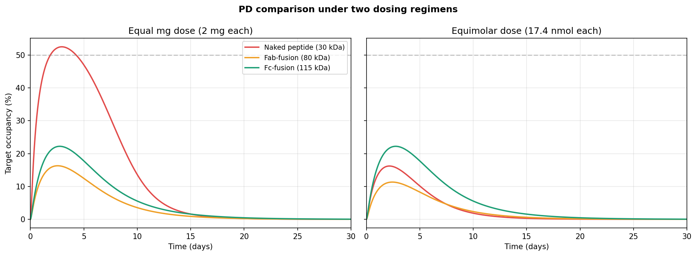

# Ocular TMDD Format Selection
### A PK/PD case study comparing molecular formats for an intravitreal biologic

A four-compartment target-mediated drug disposition (TMDD) model comparing three molecular formats — naked peptide (~30 kDa), Fab-fusion (~80 kDa), and Fc-fusion (~115 kDa) — of a hypothetical microglial-target ligand (MTL) delivered intravitreally. The model is calibrated to published rabbit ocular PK and analyzed with a full triangulation of sensitivity and identifiability methods (Sobol, structural via Lie derivatives, profile likelihood, and ABC-SMC posterior shrinkage) to translate to first-in-human dose recommendations.

The model is built as a case study demonstrating end-to-end PK/PD modeling rigor: mechanistic ODE structure, literature-anchored priors, global sensitivity, three-phase identifiability analysis, and cross-species translation — all reproducible from a single command.



*Format ranking under two dosing regimens. At equal mg dose (left), the naked peptide appears best — but this reflects molar dose, since 2 mg of a 30 kDa peptide is 4× more molecules than 2 mg of a 115 kDa Fc-fusion. At equimolar dose (right), the Fc-fusion delivers ~75% more integrated target engagement, reframing the program decision.*

---

## Key findings

- **The format ranking inverts when controlling for molar dose.** At equal mg, the naked peptide wins on molar count; at equimolar dose, the Fc-fusion delivers ~75% more integrated target engagement, driven by FcRn-mediated retinal residence extension.

- **Target abundance R₀ is the dominant uncertainty.** Sobol total-order sensitivity index for R₀ is ~0.48, the highest of any parameter, with vitreous-to-retina diffusion (k_vr) close behind at ~0.43. Measuring R₀ in iPSC-derived microglia is among the highest-leverage experiments in the characterization roadmap.

- **Slow off-rates do not rescue sustained PD.** Sweeping k_off across three orders of magnitude shows peak target occupancy plateauing once k_off < k_int. Complex internalization, not dissociation, is the rate-limiting sink — affinity maturation alone cannot deliver durable target engagement.

- **Dose should scale by vitreous volume (~2.7×), not body weight (~23×).** Cross-species translation shows ocular half-life is governed by intrinsic rate constants, not absolute volume. Standard mAb body-weight allometry would over-dose by an order of magnitude.

- **Three identifiability methods give a layered picture.** Structural rank test (Lie derivatives) shows 11 of 12 parameters are structurally identifiable from vitreous + target-occupancy data — only systemic clearance CL_p is not, since plasma is unobserved. Profile likelihood shows the binding off-rate k_off has the widest confidence interval of the profiled parameters. ABC-SMC concentrates the posterior on the true values — all 12 posterior means land within roughly a factor of two of the truth — with binding/turnover parameters showing more posterior spread than the tightly-pinned diffusion parameters. (At this particle count the 95% credible intervals are approximate; a few may not cover the truth on a given run, as expected for a likelihood-free method — scale to 1000+ for tighter coverage.) The methods are complementary: structural identifiability is binary and exact, profile likelihood and shrinkage quantify how well realistic data constrain each parameter.

---

## What's in here

```
ocular-tmdd-format-selection/
├── docs/                              Methods narrative + case study writeup
│   ├── methods.md                     Equations, priors, calibration sources
│   ├── interpretation.md              What the model says about the program
│   └── case_study.md                  Distilled summary of findings
├── model/                             Model definitions
│   ├── 01_model_definition.R          rxode2 implementation
│   ├── 02_parameters.R                Format-specific parameter sets + priors
│   ├── tmdd_model.py                  Python reference implementation
│   └── tmdd_model.stan                Stan model (production Bayesian fallback)
├── analyses/                          Numbered analysis scripts (run in order)
│   ├── 03_simulate.R                  Forward simulation of all three formats
│   ├── 04_sensitivity_sobol.py        Global variance decomposition
│   ├── 05_dose_response.py            Equimolar vs equal-mg comparison
│   ├── 06_human_translation.py        Cross-species scaling
│   ├── 07_koff_sweep.py               Binding kinetics sweep
│   ├── 08_identifiability_sian.py     Phase A: structural identifiability
│   ├── 09_identifiability_profile.py  Phase B: profile likelihood
│   └── 10_identifiability_abc.py      Phase C: ABC-SMC Bayesian
├── data/                              Synthetic IVT study data
├── results/                           Plots, tables, posterior samples
├── tests/                             Sanity checks
├── run_all.py                         One-command pipeline
└── requirements.txt                   Pinned Python dependencies
```

---

## Reproducing the analysis

```bash
git clone https://github.com/<your-handle>/ocular-tmdd-format-selection.git
cd ocular-tmdd-format-selection
pip install -r requirements.txt
python run_all.py
```

The pipeline runs Python analyses end-to-end and writes all plots and tables into `results/`. Total runtime ~15 minutes on a 4-core workstation. The R scripts in `model/` and `analyses/` are independent and require `rxode2`; they exist as a parallel reference implementation but aren't required for the Python pipeline.

The Bayesian Phase C step (ABC-SMC) takes ~3-4 minutes for 400 particles × 9 generations. Scale up to 1000+ particles for production by editing `analyses/10_identifiability_abc.py`.

---

## Methods at a glance

| Layer | Tool | Purpose |
|---|---|---|
| Forward ODE | rxode2 (R) + scipy.integrate.solve_ivp (Python) | Six-state TMDD simulation |
| Sensitivity | SALib Sobol indices | Global variance decomposition |
| Structural identifiability | JAX autodiff Lie-derivative observability rank test | Tests parameter recoverability in principle |
| Practical identifiability | Profile likelihood (Raue et al. 2009 framework) | Tests recoverability at realistic data quality |
| Bayesian inference | PyABC ABC-SMC with parallel particle sampling | Posterior shrinkage and credible intervals |
| Production fallback | Stan + cmdstanpy | HMC inference for production environments |

---

## Citations and acknowledgments

Calibration and priors anchor to:

- **Park S.J. et al. (2016).** Intraocular pharmacokinetics of intravitreal aflibercept (Eylea) in a rabbit model. *Invest Ophthalmol Vis Sci* 57:6195–6203. PMID: 27258433. Source for rabbit vitreous half-life data used to back-calculate k_va.
- **Betts A. et al. (2018).** Linear pharmacokinetic parameters for monoclonal antibodies are similar within a species and across different pharmacological targets. *mAbs* 10:751–764. Source for the typical mAb clearance prior on CL_p (0.15 mL/h/kg, 95% CI 0.14–0.16).
- **del Amo E.M. et al. (2017).** Pharmacokinetic aspects of retinal drug delivery. *Prog Retin Eye Res* 57:134–185. Source for the anterior-elimination-fraction range (51–85%).
- **Mager D.E., Jusko W.J. (2001).** General pharmacokinetic model for drugs exhibiting target-mediated drug disposition. *J Pharmacokinet Pharmacodyn* 28:507–532. Theoretical framework for the TMDD module.
- **Raue A. et al. (2009).** Structural and practical identifiability analysis of partially observed dynamical models by exploiting the profile likelihood. *Bioinformatics* 25:1923–1929. Framework for the Phase B identifiability analysis.

---

## License

MIT License. See [LICENSE](LICENSE).

---

## Notes for collaborators

The molecular target (MTL) and indication (microglial-targeting intravitreal therapy) are kept generic — the modeling framework applies to any intravitreal biologic targeting a membrane receptor expressed on retinal microglia or pigment epithelium. Plug in real binding kinetics, target abundance, and clearance priors for a specific program by editing `model/02_parameters.R`.

Contact: open an issue or discussion if you'd like to compare to a specific program.
