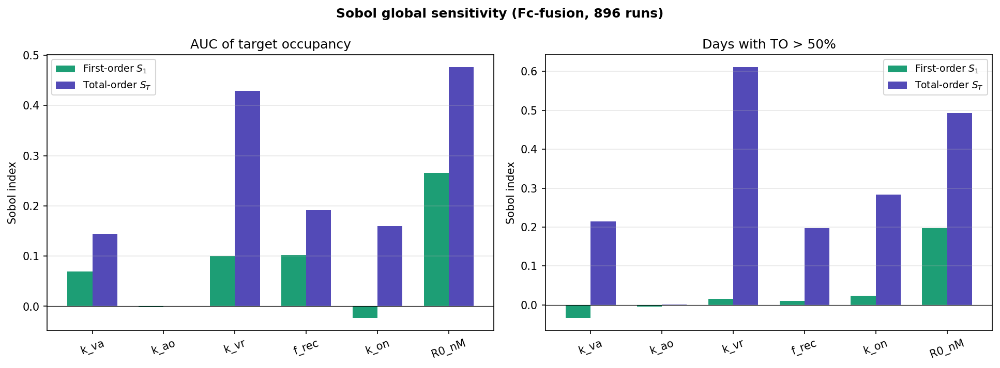
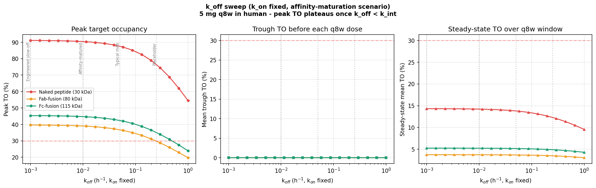
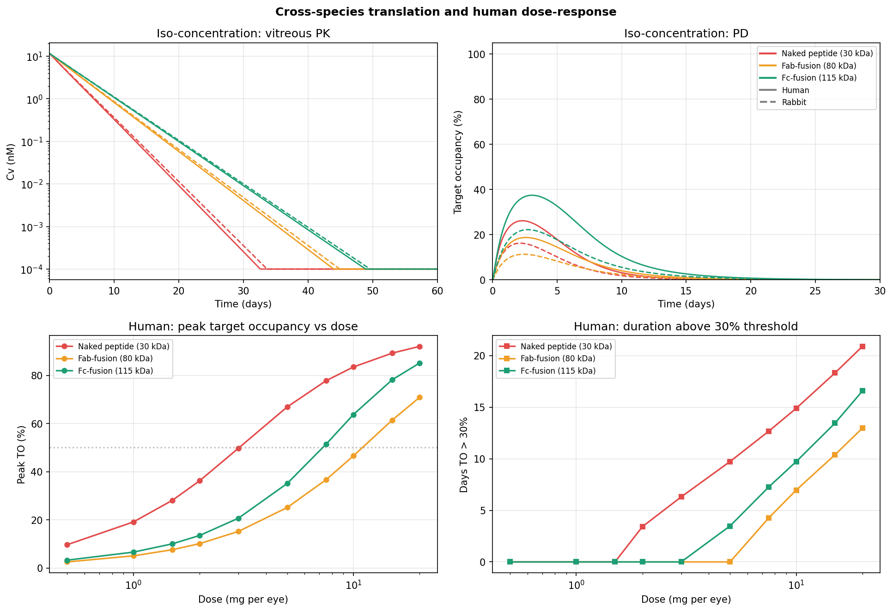
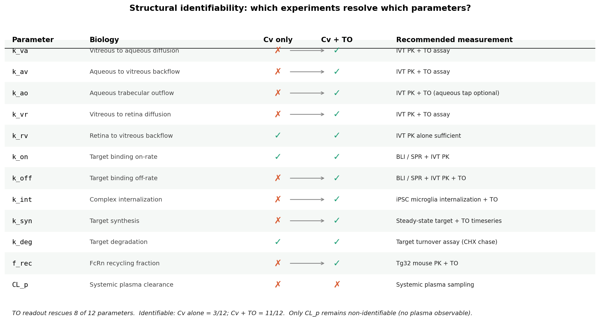
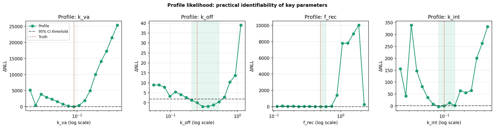
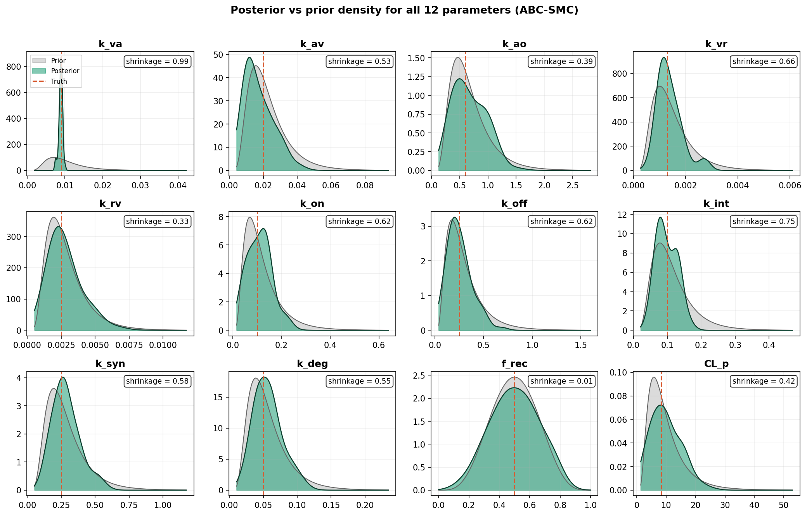
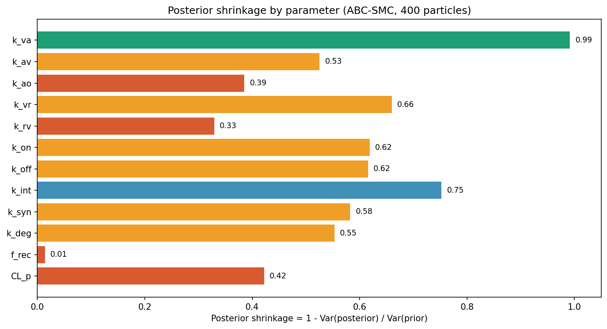

# Ocular TMDD Format Selection
### A PK/PD case study comparing molecular formats for an intravitreal biologic

A four-compartment target-mediated drug disposition (TMDD) model comparing three molecular formats — naked peptide (~30 kDa), Fab-fusion (~80 kDa), and Fc-fusion (~115 kDa) — of a hypothetical microglial-target ligand (MTL) delivered intravitreally. The model is calibrated to published rabbit ocular PK and analyzed with a full triangulation of sensitivity and identifiability methods (Sobol, structural via Lie derivatives, profile likelihood, and ABC-SMC posterior shrinkage) to translate to first-in-human dose recommendations.

The model is built as a case study demonstrating end-to-end PK/PD modeling rigor: mechanistic ODE structure, literature-anchored priors, global sensitivity, three-phase identifiability analysis, and cross-species translation — all reproducible from a single command.


*Format ranking under two dosing regimens. At equal mg dose (left), the naked peptide appears best — but this reflects molar dose, since 2 mg of a 30 kDa peptide is 4× more molecules than 2 mg of a 115 kDa Fc-fusion. At equimolar dose (right), the Fc-fusion delivers ~75% more integrated target engagement, reframing the program decision.*

---

## Key findings at a glance

- **The format ranking inverts when controlling for molar dose.** At equal mg, the naked peptide wins on molar count; at equimolar dose, the Fc-fusion delivers ~75% more integrated target engagement, driven by FcRn-mediated retinal residence extension.
- **Target abundance R₀ is the dominant uncertainty** (Sobol total-order index ~0.48, highest of any parameter, with vitreous-to-retina diffusion k_vr close behind at ~0.43).
- **Slow off-rates do not rescue sustained PD** — complex internalization, not dissociation, is the rate-limiting sink once k_off < k_int.
- **Dose should scale by vitreous volume (~2.7×), not body weight (~23×).**
- **Three identifiability methods give a layered picture** — structural (Lie derivatives), profile likelihood, and ABC-SMC posterior shrinkage are complementary, and agree that the binding/turnover parameters (k_off, k_int) are the least constrained.

The sections below walk through each result with the corresponding figure.

---

## Results

### 1. Dosing basis flips the format ranking

The headline result. The hero figure at the top of this README shows target occupancy under two dosing regimens. At **equal mg** dose the naked peptide gives the highest peak occupancy, purely because a fixed mass of a small molecule delivers more molecules. At **equimolar** dose the ranking inverts: the Fc-fusion delivers **+75.7%** integrated target engagement (AUC of occupancy) over the naked peptide, driven by FcRn-mediated extension of retinal residence time. The program decision therefore depends on whether the binder can be matured to achieve target potency at a lower molar dose — not on simple "which format is better" reasoning.

### 2. Global sensitivity prioritizes which biology to measure



*Sobol first-order (S₁) and total-order (S_T) indices for two PD readouts. Target abundance R₀ dominates; aqueous outflow k_ao has an index near zero.*

A Sobol global sensitivity analysis (896 model evaluations on six parameters with log-uniform priors) decomposes the variance in integrated target occupancy. **R₀ (target abundance) is the single dominant driver** (S_T ≈ 0.48), with vitreous-to-retina diffusion k_vr close behind (S_T ≈ 0.43). The actionable negative finding: **k_ao (aqueous outflow) has S_T ≈ 0** — once outflow exceeds the rate of vitreous-to-aqueous diffusion, which is always true physiologically, it stops affecting the output. The roadmap implication is to measure R₀ first (in iPSC-derived microglia) and not to invest in precise aqueous-outflow characterization.

### 3. Internalization, not dissociation, limits sustained PD



*Sweeping k_off across three orders of magnitude (k_on held constant — the affinity-maturation scenario) for a 5 mg q8w human regimen. Peak occupancy plateaus once k_off drops below k_int.*

Multi-dose human simulation shows that no format sustains meaningful trough occupancy at clinically plausible doses. Sweeping the off-rate down (the affinity-maturation lever) reveals **a plateau: once k_off < k_int, slowing dissociation further buys nothing**, because complex internalization has become the rate-limiting sink. Durable target engagement therefore requires either reducing k_int (a structure-activity question) or designing for transient occupancy — affinity maturation alone is insufficient.

### 4. Translation scales with vitreous volume, not body weight



*Top: iso-concentration vitreous PK and PD scaled from rabbit (dashed) to human (solid). Bottom: human dose-response on peak occupancy and duration above the 30% threshold.*

Scaling to human ocular volumes shows that vitreous half-life is set by intrinsic rate constants (k_va, k_ao), which are drug properties, not absolute volume. The human eye is ~2.7× larger than the rabbit eye, while plasma volume is ~15× larger — so **dose should scale by the vitreous-volume ratio (~2.7×), not by body weight (~23×)**. Standard mAb body-weight allometry would over-dose by an order of magnitude.

### 5a. Structural identifiability — what a target-occupancy assay buys



*Each parameter's structural identifiability under two observation scenarios, and the experiment that best constrains it. Adding a target-occupancy readout rescues 8 of 12 parameters.*

A Lie-derivative observability rank test (the SIAN methodology, implemented with JAX automatic differentiation) asks whether each parameter can be uniquely recovered from noise-free data. With **vitreous concentration alone, only 3 of 12 parameters are identifiable**; the rest trade off in unresolvable combinations. **Adding a target-occupancy readout rescues 8 parameters, bringing 11 of 12 to identifiable** — only systemic clearance CL_p remains non-identifiable, and only because plasma is never observed. This is the single highest-leverage experimental-design conclusion: a TO assay is worth far more than any additional PK sampling.

### 5b. Practical identifiability — profile likelihood



*Profile likelihood for four mechanistically key parameters. The dashed line marks the 95% confidence threshold (ΔNLL = 1.92); shaded bands show the resulting confidence interval.*

Structural identifiability is binary and assumes perfect data. Profile likelihood (Raue et al. 2009) asks how well *realistic* data constrain each parameter, using a synthetic 7-timepoint study with 15% noise on paired Cv + TO observations. Of the four parameters profiled, **k_off has the widest confidence interval (~2.5× range)**, because the binding off-rate trades off against internalization k_int in setting complex residence time. k_va is essentially pinpointed; f_rec and k_int are intermediate.

### 5c. Bayesian posterior shrinkage — ABC-SMC



*Posterior (green) vs prior (grey) density for all 12 parameters; the dashed line is the true value. Diffusion parameters collapse to sharp peaks at the truth; binding/turnover and unobserved-route parameters stay closer to their priors.*

The third leg of the identifiability analysis fits all 12 parameters jointly via Approximate Bayesian Computation with Sequential Monte Carlo (PyABC). ABC-SMC is used instead of gradient-based MCMC because it is likelihood-free, embarrassingly parallel, and runs on the same stiff-ODE solver used elsewhere. **The posterior concentrates on the true values — all 12 posterior means land within roughly a factor of two of the truth.** Diffusion parameters (k_va, k_vr) are tightly pinned; binding/turnover parameters and the unobserved-route parameters (f_rec recycling, CL_p clearance) retain substantial prior-driven spread, consistent with the structural and profile-likelihood results.



*Posterior shrinkage (1 − Var_posterior / Var_prior) per parameter. Higher means the data narrowed the parameter more, relative to its prior.*

The shrinkage bar chart summarizes how much each parameter's marginal distribution narrowed. **A methodological caveat:** at modest particle counts the 95% credible intervals are approximate and a few parameters may not cover the truth on any given run, as expected for a likelihood-free method (scale to 1000+ particles for tighter coverage). The fine-grained shrinkage *ranking* among well-constrained parameters carries Monte Carlo noise and shifts run-to-run, so the reproducible findings are the structural result (CL_p non-identifiable) and the profile-likelihood result (k_off widest CI), with ABC providing the joint-posterior picture rather than precise per-parameter rankings. Note also that high apparent shrinkage for CL_p, when it appears, is an SMC perturbation-kernel artifact, not data-driven learning — CL_p governs only the unobserved plasma compartment.

---

## What's in here

```
ocular-tmdd-format-selection/
├── docs/                              Methods narrative + case study writeup
│   ├── methods.md                     Equations, priors, calibration sources
│   ├── interpretation.md              What the model says about the program
│   └── case_study.md                  Distilled summary of findings
├── model/                             Model definitions
│   ├── 01_model_definition.R          rxode2 implementation
│   ├── 02_parameters.R                Format-specific parameter sets + priors
│   ├── tmdd_model.py                  Python reference implementation
│   └── tmdd_model.stan                Stan model (production Bayesian fallback)
├── analyses/                          Numbered analysis scripts (run in order)
│   ├── 00_generate_synthetic_data.py  Synthetic IVT dataset for Phase B/C
│   ├── 03_calibration.py              Verify k_va vs Park 2016 half-lives
│   ├── 03_simulate.R                  Forward simulation (R reference)
│   ├── 04_sensitivity_sobol.py        Global variance decomposition
│   ├── 05_dose_response.py            Equimolar vs equal-mg comparison
│   ├── 06_human_translation.py        Cross-species scaling
│   ├── 07_koff_sweep.py               Binding kinetics sweep
│   ├── 08_identifiability_sian.py     Phase A: structural identifiability
│   ├── 09_identifiability_profile.py  Phase B: profile likelihood
│   └── 10_identifiability_abc.py      Phase C: ABC-SMC Bayesian
├── data/                              Synthetic IVT study data
├── results/
│   ├── plots/                         8 figures (shown above)
│   ├── tables/                        CSV/JSON summaries
│   └── posteriors/                    ABC-SMC posterior samples
├── tests/                             Sanity checks
├── run_all.py                         One-command pipeline
└── requirements.txt                   Pinned Python dependencies
```

The eight figures above are generated into `results/plots/` by the pipeline:
`equimolar_inversion.png` (§1), `sobol_indices.png` (§2), `koff_sweep.png` (§3), `human_translation.png` (§4), `identifiability_summary.png` (§5a), `profile_likelihood.png` (§5b), `abc_posterior_vs_prior.png` and `abc_shrinkage.png` (§5c).

---

## Reproducing the analysis

```bash
git clone https://github.com/<your-handle>/ocular-tmdd-format-selection.git
cd ocular-tmdd-format-selection
pip install -r requirements.txt
python run_all.py
```

The pipeline runs Python analyses end-to-end and writes all plots and tables into `results/`. Total runtime ~15 minutes on a 4-core workstation. The R scripts in `model/` and `analyses/` are independent and require `rxode2`; they exist as a parallel reference implementation but aren't required for the Python pipeline.

The Bayesian Phase C step (ABC-SMC) takes ~3-4 minutes for 400 particles × 9 generations. Scale up to 1000+ particles for production by editing `analyses/10_identifiability_abc.py`.

---

## Methods at a glance

| Layer | Tool | Purpose |
|---|---|---|
| Forward ODE | rxode2 (R) + scipy.integrate.solve_ivp (Python) | Six-state TMDD simulation |
| Sensitivity | SALib Sobol indices | Global variance decomposition |
| Structural identifiability | JAX autodiff Lie-derivative observability rank test | Tests parameter recoverability in principle |
| Practical identifiability | Profile likelihood (Raue et al. 2009 framework) | Tests recoverability at realistic data quality |
| Bayesian inference | PyABC ABC-SMC with parallel particle sampling | Posterior shrinkage and credible intervals |
| Production fallback | Stan + cmdstanpy | HMC inference for production environments |

---

## Citations and acknowledgments

Calibration and priors anchor to:

- **Park S.J. et al. (2016).** Intraocular pharmacokinetics of intravitreal aflibercept (Eylea) in a rabbit model. *Invest Ophthalmol Vis Sci* 57:6195–6203. PMID: 27258433. Source for rabbit vitreous half-life data used to back-calculate k_va.
- **Betts A. et al. (2018).** Linear pharmacokinetic parameters for monoclonal antibodies are similar within a species and across different pharmacological targets. *mAbs* 10:751–764. Source for the typical mAb clearance prior on CL_p (0.15 mL/h/kg, 95% CI 0.14–0.16).
- **del Amo E.M. et al. (2017).** Pharmacokinetic aspects of retinal drug delivery. *Prog Retin Eye Res* 57:134–185. Source for the anterior-elimination-fraction range (51–85%).
- **Mager D.E., Jusko W.J. (2001).** General pharmacokinetic model for drugs exhibiting target-mediated drug disposition. *J Pharmacokinet Pharmacodyn* 28:507–532. Theoretical framework for the TMDD module.
- **Raue A. et al. (2009).** Structural and practical identifiability analysis of partially observed dynamical models by exploiting the profile likelihood. *Bioinformatics* 25:1923–1929. Framework for the Phase B identifiability analysis.

---

## License

MIT License. See [LICENSE](LICENSE).

---

## Notes for collaborators

The molecular target (MTL) and indication (microglial-targeting intravitreal therapy) are kept generic — the modeling framework applies to any intravitreal biologic targeting a membrane receptor expressed on retinal microglia or pigment epithelium. Plug in real binding kinetics, target abundance, and clearance priors for a specific program by editing `model/02_parameters.R`.

Contact: open an issue or discussion if you'd like to compare to a specific program.
